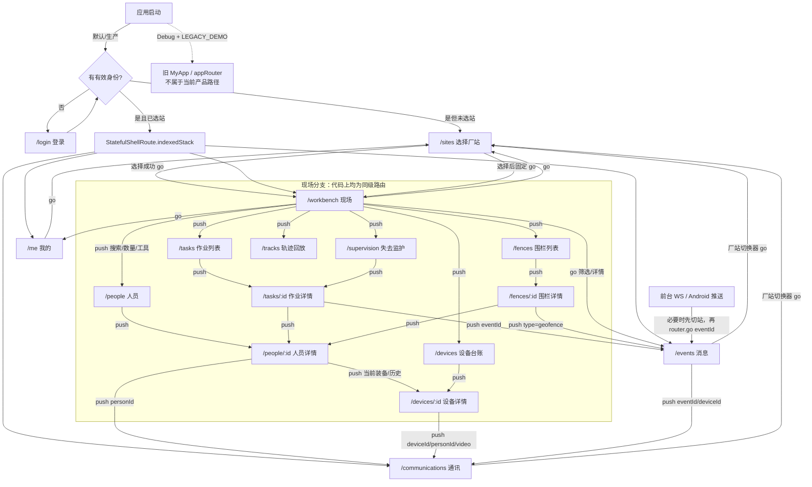

# 安卓页面功能与跳转关系分析

> **V3使用说明（2026-09-17）：本文保留为回退版本的静态代码与跳转基线。** 原07—09目标方案已被用户撤销，文中若仍链接旧方案，仅作历史追溯。后续按 [10-开发指南](10-安卓开发指南-预览图复刻与微调.md)、[11-逐页说明](11-安卓逐页开发说明与跳转保留表.md)、[12-强限制](12-安卓开发强限制与验收清单.md) 执行；本次不改代码。

> **文档关系：本文件是当前代码现状基线。** 原有事实、路由和重复分析继续保留；目标页面与整改建议以本轮 [07-安卓页面职责与冲突整改方案.md](07-安卓页面职责与冲突整改方案.md) 和 [08-安卓统一视觉与明暗主题规范.md](08-安卓统一视觉与明暗主题规范.md) 为准。本文旧建议不再作为“所有原入口必须保留”的约束。简短审核入口见 [09-安卓整改重点总结-审核预览.md](09-安卓整改重点总结-审核预览.md)。

> 分析范围：`android代码/melhat_android-main/lib/wear` 全部页面、路由、事件、通讯、查询、会话与通知代码，以及 `lib/main.dart` 的新版/旧版启动开关。本文结论来自 2026-09-17 的静态源码分析，不代表模拟器或真机运行验收；本文未修改 UI 或业务代码。

## 1. 先给结论

1. 当前正常 Debug、Release、Profile 构建都进入新版 `WearApp`。旧版 `MyApp + appRouter` 只有在 **Debug 且编译时显式传入 `LEGACY_DEMO=true`** 时才启用，因此旧版 `/home/tab1` 等页面不属于当前真实页面体系。证据：`android代码/melhat_android-main/lib/main.dart:23-28`、`android代码/melhat_android-main/lib/main.dart:58-72`、`android代码/melhat_android-main/lib/router/app_router.dart:89-170`。
2. 当前真实底栏是 **现场 / 通讯 / 消息 / 我的**，分别对应 `/workbench`、`/communications`、`/events`、`/me`。没有“工作台”或“事件”文字标签；`workbench` 和 `events` 只是代码路由名。证据：`android代码/melhat_android-main/lib/wear/app.dart:57-150`、`android代码/melhat_android-main/lib/wear/app.dart:395-429`。
3. 现场分支中的人员、设备、轨迹、围栏、作业等路由在代码上都是同一 `StatefulShellBranch` 下的**同级路由**，没有写成 `/people/:id` 是 `/people` 的 children 这种嵌套结构。它们只有业务上的“列表 → 详情”父子关系。证据：`android代码/melhat_android-main/lib/wear/app.dart:61-104`。
4. 首页存在明显重复和占位混入：同一份 `activeTasks` 同时生成顶部“当前作业”卡和下方“当前作业”列表；顶部卡无数据时仍显示固定作业，而且负责人/监护人即使有真实任务也始终固定为“李志远/周明”。证据：`android代码/melhat_android-main/lib/wear/queries/workbench.dart:116-118`、`:231-260`、`:469-533`。
5. 首页“我的装备”混用了真实接口数据和无标识的固定展示数据：接口缺某种类型时补出 `RL-H001/RL-B001/RL-W001`，且固定展示“安全带连接中断”告警；用户无法从视觉上判断这些不是服务端真实记录。证据：`android代码/melhat_android-main/lib/wear/queries/workbench.dart:59-69`、`:590-621`、`:624-680`。
6. 通讯页的“多选”不是组呼：多选解析出多个可呼设备后只选择第一个发起单呼，并提示“群体通话待服务端开通”。“安全帽呼叫”也只检查本人是否绑定安全帽，后续仍调用同一个本机单呼逻辑，`fromHelmet` 没有传到接口。证据：`android代码/melhat_android-main/lib/wear/communications/communications_page.dart:520-611`、`:1042-1079`。
7. 设备详情的“TTS”和“对讲”按钮传入完全相同的 `/communications?deviceId=...&personId=...`，没有 `mode` 参数；只有“视频”额外传 `video=1`，而通讯页也不会自动发起视频，只用于能力提示。因此 TTS/对讲是不同文案的同一落点。证据：`android代码/melhat_android-main/lib/wear/queries/devices.dart:355-419`、`android代码/melhat_android-main/lib/wear/app.dart:107-117`、`android代码/melhat_android-main/lib/wear/communications/communications_page.dart:612-620`。
8. 登录页的“忘记密码”目前是伪提交：本地校验表单后直接关闭弹窗并提示“重置申请已记录”，没有调用任何 API。验证码则是真接口优先，失败时退回本地四位码；本地码只作为客户端登录前校验，不提交给服务端。证据：`android代码/melhat_android-main/lib/wear/auth_pages.dart:73-127`、`:138-228`。

## 2. 应用入口、鉴权和全局范围

### 2.1 新旧版启动边界

`main()` 的判断为：

```dart
if (!kDebugMode || !const bool.fromEnvironment('LEGACY_DEMO')) {
  runApp(const WearApp());
  return;
}
```

因此：

| 构建方式 | 实际入口 | 路由体系 |
|---|---|---|
| Release / Profile | `WearApp` | 本文分析的 `/workbench` 等新版路由 |
| 普通 Debug | `WearApp` | 本文分析的新版路由 |
| Debug + `LEGACY_DEMO=true` | `MyApp` | 旧 `appRouter`，起点 `/splash`，底层为 `/home/tab1...tab4` |

证据：`android代码/melhat_android-main/lib/main.dart:16-28`、`:30-58`；旧路由只由 `MyApp` 引用，见 `android代码/melhat_android-main/lib/main.dart:61-87`、`android代码/melhat_android-main/lib/router/app_router.dart:89-170`。

### 2.2 新版全局重定向

新版初始地址是 `/workbench`，但全局重定向优先处理会话：

- 未登录：除 `/login` 外统一跳 `/login`。
- 已登录但未选择厂站：除 `/sites` 外统一跳 `/sites`。
- 通话中访问 `/sites`：强制返回 `/communications`。
- 已登录访问 `/login`：跳 `/workbench`。

证据：`android代码/melhat_android-main/lib/wear/app.dart:33-45`。登录令牌存于安全存储 `wear.access-token`；恢复后重新请求 `/api/v1/me`，不会信任旧明文身份缓存。单厂站账号会自动写入当前厂站。证据：`android代码/melhat_android-main/lib/wear/session.dart:15-23`、`:105-123`、`:169-183`。

所有 `/api/v1/` 业务请求（少数全局接口除外）都会带 `X-Site-Id`；切账号或厂站会递增 epoch、取消旧请求，迟到响应不会写入新范围。证据：`android代码/melhat_android-main/lib/wear/api.dart:16-23`、`:45-48`、`:73-120`。

## 3. 完整路由表

路由定义集中在 `android代码/melhat_android-main/lib/wear/app.dart:33-153`。

| 路径 | 所属层级/底栏分支 | 页面 | 参数及进入效果 | 主要入口 |
|---|---|---|---|---|
| `/login` | Shell 外 | `WearLoginPage` | 无 | 全局未登录重定向 |
| `/sites` | Shell 外 | `WearSitesPage` | 无 | 首次选站；各页厂站切换器；“我的”切换厂站 |
| `/workbench` | 分支 0：现场根页 | `WorkbenchPage` | 无 | 默认入口；选站成功；底栏“现场”首次进入 |
| `/people` | 分支 0，同级查询页 | `PeoplePage` | `name`：预填姓名搜索并请求第一页 | 首页搜索、人员数量、现场工具 |
| `/people/:id` | 分支 0，同级详情页 | `PersonPage` | `id`：人员稳定 ID | 人员列表、任务成员、围栏适用人员、设备领用历史 |
| `/supervision` | 分支 0，同级聚合页 | `SupervisionPage` | 无 | 首页“失去监护”指标 |
| `/devices` | 分支 0，同级查询页 | `DevicesPage` | 无 | 首页装备、设备数量、现场工具、占位装备行 |
| `/devices/:id` | 分支 0，同级详情页 | `DevicePage` | `id`：设备 ID | 设备列表、人员装备/领用记录、首页真实装备行 |
| `/tracks` | 分支 0，同级工具页 | `TracksPage` | `personId`：先按 ID加载人员并自动查轨迹 | 现场工具；当前代码没有传 `personId` 的 UI 入口 |
| `/fences` | 分支 0，同级查询页 | `FencesPage` | 无 | 现场工具 |
| `/fences/:id` | 分支 0，同级详情页 | `FencePage` | `id`：围栏 ID | 围栏列表 |
| `/tasks` | 分支 0，同级查询页 | `TasksPage` | 无；默认“我的任务” | 首页当前作业、全部作业、现场工具、无真实当前作业时的顶部卡 |
| `/tasks/:id` | 分支 0，同级详情页 | `TaskPage` | `id`：作业 ID | 首页作业、作业列表、失去监护聚合 |
| `/communications` | 分支 1：通讯根页 | `CommunicationsPage` | `deviceId`、`personId`、`eventId`；`video=true/1` 仅形成视频意图提示 | 底栏；人员详情；设备能力；消息详情 |
| `/events` | 分支 2：消息根页 | `EventsPage` | `eventId`、`personId`、`taskId`、`status`、`type`、`claimantUserId`、`escalated=true` | 底栏；首页指标/近期事件/消息图标；作业/围栏；推送通知 |
| `/me` | 分支 3：我的根页 | `WearMinePage` | 无 | 底栏；首页“查看我的装备” |

参数映射证据：`android代码/melhat_android-main/lib/wear/app.dart:63-102`、`:107-137`、`:143-147`。需要注意，`/people/:id`、`/devices/:id`、`/tasks/:id` 等虽是业务详情页，在路由定义中并不是列表路由的 children。

## 4. 页面跳转图



## 5. 返回栈与 `go` / `push` 行为

### 5.1 底栏保存四个分支状态

底栏使用 `StatefulShellRoute.indexedStack`，四个分支各自拥有导航状态；点击底栏调用 `goBranch(index)`。这意味着从现场进入 `/devices/:id` 后切到消息，再切回现场，通常会回到此前的设备详情，而不是自动回到 `/workbench`。当前也没有在“重复点击已选中的现场 tab”时传 `initialLocation: true` 来重置分支。证据：`android代码/melhat_android-main/lib/wear/app.dart:57-60`、`:395-402`。

这属于保留上下文的设计，但如果产品预期“点底栏一定回根页”，当前实现不符合该预期。

### 5.2 `push` 用于查询页、详情页和上下文跨页

现场工具、列表到详情、人员到设备、设备/人员/消息到通讯等使用 `context.push`。按 go_router 语义，它请求在导航历史上增加一层，因此查询页 `QueryPage` 的普通 `AppBar` 会显示系统返回按钮，返回源页。证据：`android代码/melhat_android-main/lib/wear/queries/query_widgets.dart:19-60`；典型调用见 `workbench.dart:234-335`、`people.dart:182-183`、`devices.dart:405-419`。

跨底栏分支也出现了 `push`，例如作业详情 `push('/events?...')`、消息详情 `push('/communications?...')`。代码意图是保留来源并允许返回，但它同时改变当前底栏分支，行为比“切 tab”更重，后续应统一产品规则。证据：`android代码/melhat_android-main/lib/wear/queries/tasks.dart:385-411`、`android代码/melhat_android-main/lib/wear/events/events_page.dart:580-590`。

### 5.3 `go` 用于主目的地替换，不形成详情返回层

首页的消息图标、事件指标、近期事件和核验入口均用 `context.go('/events...')`，首页“查看我的装备”用 `go('/me')`。这类入口直接切主分支，不应期待系统返回回首页。证据：`android代码/melhat_android-main/lib/wear/queries/workbench.dart:152-190`、`:201-225`、`:400-406`、`:674-685`、`:749-759`。

通知点击同样调用 `_router.go('/events?eventId=...')`；若通知属于另一授权厂站，会先切站、再校验事件确属当前用户/厂站后打开。证据：`android代码/melhat_android-main/lib/wear/app.dart:158-174`。

### 5.4 厂站选择固定返回现场根页

各 Hero 中的厂站切换器和“我的”按钮都 `go('/sites')`；选站成功固定 `go('/workbench')`，并不会回到发起切换的通讯、消息或详情页。通话中则禁用/重定向切站。证据：`android代码/melhat_android-main/lib/wear/ui.dart:272-297`、`android代码/melhat_android-main/lib/wear/auth_pages.dart:643-703`、`android代码/melhat_android-main/lib/wear/session.dart:186-212`。

### 5.5 消息详情不是独立路由

`eventId` 只让 `/events` 页面在同一滚动工作区内选中并展开详情；关闭图标和 Android 返回键只执行 `controller.closeDetail()`。`PopScope` 会先收起详情，再允许离开页面。证据：`android代码/melhat_android-main/lib/wear/events/events_page.dart:223-231`、`:294-299`、`:485-505`。

关闭详情时没有同步移除 URI 中的 `eventId`，因此界面状态与地址可能暂时不一致；后续若路由因外部原因按同一 URI 重建，可能再次按该参数选中事件。证据：`android代码/melhat_android-main/lib/wear/events/events_page.dart:76-90`、`:501-504`。

### 5.6 `Navigator.pop` 基本只关闭弹窗/底部面板

登录问题、值班交接、事件关闭/转交/关联任务等使用 `Navigator.pop` 返回布尔值或表单选择，不是页面级路由跳转。证据：`android代码/melhat_android-main/lib/wear/auth_pages.dart:138-228`、`android代码/melhat_android-main/lib/wear/queries/workbench.dart:861-944`、`android代码/melhat_android-main/lib/wear/events/events_page.dart:866-1159`。

## 6. 逐页功能、数据和行为

### 6.1 `/login` 登录

- 页面输入账号、密码、验证码；服务端验证码来自 `GET /captchaImage`。接口异常时生成避开易混字符的本地四位码。证据：`android代码/melhat_android-main/lib/wear/auth_pages.dart:44-99`。
- 提交前校验本地验证码；服务端验证码启用时把 `code/uuid` 传给 `WearSession.login()`，最终 `POST /login`，随后请求 `GET /api/v1/me`。证据：`android代码/melhat_android-main/lib/wear/auth_pages.dart:103-127`、`android代码/melhat_android-main/lib/wear/session.dart:125-183`。
- 本地验证码模式只在客户端阻挡错误输入；登录请求不带本地码。它是接口不可用时的 UI 降级，并不是服务端验证码。证据：`android代码/melhat_android-main/lib/wear/auth_pages.dart:110-123`。
- “忘记密码”打开底部表单，校验账号、新密码和二次确认；确认后只提示“申请已记录”，没有网络请求。这是伪功能，不能据此认为密码重置已提交。证据：`android代码/melhat_android-main/lib/wear/auth_pages.dart:138-228`。

### 6.2 `/sites` 选择工作厂站

- 数据直接来自 `/api/v1/me` 的 `authorizedSites`，仅保留状态为空或 `0` 的厂站。证据：`android代码/melhat_android-main/lib/wear/session.dart:67-75`。
- 选择后 `PUT /api/v1/me/current-site`，校验服务端返回的 `currentSiteId`，更新会话范围并刷新各页。证据：`android代码/melhat_android-main/lib/wear/session.dart:186-212`。
- 已有厂站时顶部返回按钮固定去 `/workbench`；列表选择成功也固定去 `/workbench`。证据：`android代码/melhat_android-main/lib/wear/auth_pages.dart:643-695`。

### 6.3 `/workbench` 现场首页

真实加载源：

- `GET /api/v1/duty/summary`：待认领、我的、逾期、失去监护、近期事件、当前作业、人员/设备数量。
- `GET /api/v1/me/equipment`：本人装备。
- `GET /api/v1/events/inbox/count`：消息角标。

三个请求及失败降级见 `android代码/melhat_android-main/lib/wear/queries/workbench.dart:47-90`。

页面从上到下的功能：

1. 顶部厂站名可切站；消息铃铛 `go('/events')`。证据：`workbench.dart:351-410`。
2. “查看待认领事件/打开事件中心”根据 `unclaimed` 决定是否带 `status=open`；值班角色可发起交接。交接先查 `/api/v1/duty/operators`，再 `POST /api/v1/duty/handovers`。证据：`workbench.dart:749-779`、`:828-958`。
3. 顶部“当前作业”卡取 `activeTasks.first`，按钮进入该任务；若无任务则进入任务列表。证据：`workbench.dart:469-483`。
4. “我的装备”行进入设备详情或设备台账；固定告警“去核验”进入消息；“查看我的装备”实际进入整个 `/me` 页。证据：`workbench.dart:624-703`。
5. 人员搜索会 `push('/people?name=...')`，不是通讯联系人选择。证据：`workbench.dart:120-133`、`:970-978`。
6. 四个指标：待认领/我的/逾期用 `go` 打开带筛选的消息；失去监护 `push` 聚合页。证据：`workbench.dart:135-199`。
7. 近期未关闭事件直接 `go('/events?eventId=...')`；下方当前作业列表进入任务详情；人员/设备数量和现场工具再提供人员、设备、轨迹、围栏、任务入口。证据：`workbench.dart:201-337`。

### 6.4 `/people` 人员列表

- `GET /api/v1/people`，每页 20；按姓名和人员状态筛选。首页姓名搜索通过 `name` 参数预填。证据：`android代码/melhat_android-main/lib/wear/queries/people.dart:8-50`、`:59-77`、`:100-198`。
- 每行显示姓名、人员编号、班组、状态；进入 `/people/:id`。人员档案与登录账号被明确区分。证据：`people.dart:103-104`、`:165-184`。

### 6.5 `/people/:id` 人员详情

- 并行请求人员详情和历史领用：`GET /api/v1/people/:id`、`GET /api/v1/people/:id/assignments`。证据：`people.dart:231-251`。
- 展示编号、状态、班组、承包商、有效期；“当前装备”另请求 `/api/v1/people/:id/equipment`，装备行进入设备详情。证据：`people.dart:265-318`、`:376-430`。
- “联系该人员”传 `personId` 进入通讯页；通讯页再解析其装备并默认选第一件。证据：`people.dart:312-318`、`communications_page.dart:121-134`。
- 历史领用记录可进入设备详情。证据：`people.dart:320-334`。

### 6.6 `/supervision` 失去监护人员

- 拉取**全部**进行中作业，每页 100 循环翻页，再按每批 8 个任务请求各任务 `/equipment-check`。证据：`android代码/melhat_android-main/lib/wear/queries/supervision.dart:64-109`。
- 只聚合安全帽结果为 `missing` 或 `unknown` 的人员，以人员稳定 ID 去重；一个人可对应多项作业。证据：`supervision.dart:7-38`。
- 点击异常关联作业进入 `/tasks/:id`。证据：`supervision.dart:130-220`。
- 这是客户端聚合查询，任务多时请求数随任务数增长，不是单一服务端“失去监护”接口。

### 6.7 `/devices` 设备台账

- `GET /api/v1/devices`，每页 20；支持 SN、设备类型、安全帽/安全带、资产状态筛选。证据：`android代码/melhat_android-main/lib/wear/queries/devices.dart:44-63`、`:86-192`。
- 连接状态来自 `connectionQuality + online`，电量和最后上报均来自设备数据；列表进入设备详情。证据：`devices.dart:157-178`、`android代码/melhat_android-main/lib/wear/queries/query_utils.dart:64-77`。

### 6.8 `/devices/:id` 设备详情

- 并行请求设备和历史领用：`GET /api/v1/devices/:id`、`GET /api/v1/devices/:id/assignments`。证据：`devices.dart:241-261`。
- 展示类型、型号、厂站、资产/连接、电量、最后上报；`demo=true` 时明确显示“演示数据”。证据：`devices.dart:275-325`。
- 历史领用记录可反跳人员详情。证据：`devices.dart:331-347`。
- 根据 `capabilities.actions` 显示 TTS、对讲、视频。TTS/对讲的跳转参数完全相同，视频只多 `video=1`。证据：`devices.dart:355-419`、`android代码/melhat_android-main/lib/wear/queries/query_utils.dart:88-91`。

### 6.9 `/tracks` 轨迹回放

- 可按姓名查人员，也可接收 `personId` 直接加载；人员来源 `/api/v1/people`。证据：`android代码/melhat_android-main/lib/wear/queries/tracks.dart:44-90`、`:105-144`。
- 轨迹接口 `/api/v1/locations/people/:id/tracks`，按 UTC 起止时间分页获取，客户端最多保留 500 点。证据：`tracks.dart:146-182`。
- 使用真实经纬度绘制 OpenStreetMap 折线和当前位置，可选日期、拖动进度、按时间定位、0.5/1/2/5 倍回放。证据：`tracks.dart:204-319`、`:322-460`、`:465-544`。

### 6.10 `/fences` 与 `/fences/:id` 电子围栏

- 列表 `GET /api/v1/fences`，每页 20，只读展示适用范围、规则版本、启停状态。证据：`android代码/melhat_android-main/lib/wear/queries/fences.dart:36-50`、`:73-124`。
- 详情 `GET /api/v1/fences/:id`，用真实 polygon 在 OpenStreetMap 绘制；展示时段、方向、防抖、规则版本，演示围栏有明确标识。证据：`fences.dart:159-177`、`:191-280`。
- 指定人员目前只显示“人员 ID”，点击进入人员详情；“查看围栏事件”进入 `push('/events?type=geofence')`。证据：`fences.dart:283-318`。

### 6.11 `/tasks` 作业列表

- 默认“我的任务”，调用 `/api/v1/work-tasks/mine`；切“全站作业”后调用 `/api/v1/work-tasks`，并可按状态、类型筛选。证据：`android代码/melhat_android-main/lib/wear/queries/tasks.dart:22-63`、`:86-158`。
- 当前页按进行中、待开始、已结束、未知在客户端分组；每行进入任务详情。证据：`tasks.dart:87-92`、`:162-211`。

### 6.12 `/tasks/:id` 作业详情

- 并行请求 `/work-tasks/:id`、`/equipment-check`、`/events`。证据：`tasks.dart:266-289`。
- 展示任务状态、类型、区域、计划/实际时间、工作票，演示任务明确标识。证据：`tasks.dart:303-350`。
- 成员进入人员详情；装备检查只展示结果；关联事件进入 `/events?eventId=...`。证据：`tasks.dart:354-411`。

### 6.13 `/communications` 通讯

进入时的解析顺序：

1. 拉人员选项 `/api/v1/people/options`、设备 `/api/v1/devices`、本人装备 `/api/v1/me/equipment`。
2. 有 `eventId` 时先查事件并补设备 ID、识别 SOS 类型。
3. 有 `personId` 时查该人员装备并优先选择目标设备或第一件装备。
4. 有 `deviceId` 时直接查设备，并尝试关联领用人。
5. 按事件或设备加载相关会话。

证据：`android代码/melhat_android-main/lib/wear/communications/communications_page.dart:89-175`；接口定义见 `communications/api_gateway.dart:83-151`。

主要行为：

- 搜索结果同时铺平“人员”和“设备”，联系人可以是人也可以是设备；多选计数统一显示“已选 N 人”，即使选择的是设备。证据：`communications_page.dart:341-499`、`:948-969`。
- 人员会解析到其第一件支持 `intercom` 的装备，否则退回第一件装备。证据：`communications_page.dart:1019-1039`。
- 单呼：`POST /api/v1/calls`，传一个 `deviceId`、`kind`、`video`、幂等键及可选 `eventId`；取得 RTC 凭证后使用 Agora 加入频道。证据：`communications/api_gateway.dart:10-37`、`communications/controller.dart:95-158`、`communications/rtc_engine.dart:89-164`。
- 通话状态轮询详情，支持发起人恢复待接通会话、静音、结束；结束接口 `/calls/:id/end`。证据：`communications/controller.dart:165-204`、`:346-468`。
- TTS 只对当前选中单设备提交，接口 `/api/v1/commands/tts`；页面明确“已提交不代表现场已听到”。证据：`communications/controller.dart:484-520`、`communications/api_gateway.dart:65-81`。
- 视频只有设备同时支持 `intercom` 和 `video`、账号有 `wear:call:start` 时可发起；演示会话不会连接真实 RTC，真实连接前显示占位画面。证据：`communications/policy.dart:9-19`、`communications_page.dart:783-837`、`communications/controller.dart:129-134`。

能力未闭环：

- 多选大于 1 仍只 `selectDevice(resolved.first)` 并发单呼。证据：`communications_page.dart:1056-1079`。
- “安全帽呼叫”的 `fromHelmet` 只用于判空，没有写入网关参数，实际仍从 App RTC 发起同一目标单呼。证据：`communications_page.dart:1042-1079`、`communications/api_gateway.dart:10-27`。
- `video` 路由参数不会自动发起呼叫，只在设备不支持视频时显示提示。证据：`communications_page.dart:612-620`。

### 6.14 `/events` 消息（事件工作区）

这是底栏“消息”，不是名为“事件”的底栏。页面把事件列表、筛选、详情、处置、复核放在同一工作区。证据：`android代码/melhat_android-main/lib/wear/events/events_page.dart:233-333`。

- 普通列表调用 `/api/v1/events`；支持状态、类型、人员、认领人、升级筛选。传 `taskId` 时改查 `/work-tasks/:id/events`，其余条件在客户端过滤和分页。证据：`android代码/melhat_android-main/lib/wear/events/event_repository.dart:18-71`。
- 详情并行查 `/events/:id` 和 `/events/:id/actions`；展示人员、设备、时间、坐标质量、关联任务、认领人和动作时间线。证据：`event_repository.dart:97-107`、`events_page.dart:485-605`。
- 有设备时可带 `eventId + deviceId` 进入通讯，使通话/TTS与事件关联。证据：`events_page.dart:580-590`。
- 操作包括确认看见、认领、处置、转交、关闭、重开、关联任务；服务端路径统一为 `/events/:id/{ack|claim|handle|transfer|close|reopen|task}`，用事件版本处理并发冲突。证据：`event_repository.dart:118-164`。
- 权限和状态受策略约束：认领需要值班角色及权限且状态为 open；只有当前认领人可处置/转交；高风险事件由复核角色在 pending_review 状态关闭；重开需复核角色。证据：`android代码/melhat_android-main/lib/wear/events/event_policy.dart:16-60`。
- 筛选、选中事件、滚动位置、未提交草稿按用户+厂站存于 SharedPreferences；退出会清除该用户 `wear.<userId>.*`。证据：`event_controller.dart:96-123`、`event_state_store.dart:21-82`、`android代码/melhat_android-main/lib/wear/session.dart:226-262`。
- SOS 详情中的地图是固定厂区图片，文字已明确“厂区示意·非实测”；真实经纬度仅以文本展示。证据：`events_page.dart:540-570`。

### 6.15 `/me` 我的

- 展示当前账号、角色、厂站；角色来自身份接口。证据：`android代码/melhat_android-main/lib/wear/mine_page.dart:120-175`。
- 展示前台 WebSocket、通知权限、推送绑定状态，可申请权限、开系统设置、重试绑定。证据：`mine_page.dart:177-239`。
- “我的装备”使用 `GET /api/v1/me/equipment` 的真实结果，装备行进入设备详情；无装备时显示空状态，不补固定设备。证据：`mine_page.dart:241`、`android代码/melhat_android-main/lib/wear/queries/people.dart:344-495`。
- 值班交接列表来自 `/api/v1/duty/handovers`；待接班且当前用户是接班人时可 `POST /duty/handovers/:id/confirm`。证据：`mine_page.dart:39-100`、`:243-315`。
- 可切换厂站或确认退出；通话中两者均禁用。退出会尝试解绑推送、注销服务端会话并清本地草稿/缓存。证据：`mine_page.dart:319-355`、`android代码/melhat_android-main/lib/wear/session.dart:226-267`。

### 6.16 前台接警与后台推送（跨页面）

- 前台 WebSocket 地址为 `/ws/{userId}/2?token=...`，20 秒心跳、45 秒无 pong 重连；收到事件后刷新角标并在 Shell 顶部显示通知条。证据：`android代码/melhat_android-main/lib/wear/notifications.dart:415-479`、`android代码/melhat_android-main/lib/wear/app.dart:355-380`。
- Android 推送绑定写 `/api/v1/me/push-installations/:installationId`，解绑删除同一路径；状态文字明确“锁屏到达待真机验收”，不能把代码存在等同于已验收。证据：`notifications.dart:257-345`。

## 7. 联系人、设备与通讯的完整跳转关系

| 来源 | 传参 | 通讯页如何处理 | 结论 |
|---|---|---|---|
| 人员详情“联系该人员” | `personId` | 查人员装备，默认第一件 | 合理的上下文入口，但多人/多装备时用户未先明确选择目标设备 |
| 设备详情 TTS | `deviceId + personId` | 选中设备，显示通话与 TTS区域 | 与“对讲”落点完全相同，没有自动聚焦 TTS |
| 设备详情 对讲 | `deviceId + personId` | 同上 | 文案不同但行为相同，属于重复/伪定向入口 |
| 设备详情 视频 | `deviceId + personId + video=1` | 选中设备；不自动发起，仅在不支持视频时提示 | 有意图参数但闭环不完整 |
| 消息详情“打开可用通信能力” | `eventId + deviceId` | 查事件类型、设备和事件会话；SOS 时 call kind 为 `sos` | 合理，保留事件关联 |
| 通讯底栏 | 无 | 加载全体人员、最多 50 设备、本人装备 | 通用入口 |

证据集中在 `android代码/melhat_android-main/lib/wear/queries/people.dart:312-318`、`queries/devices.dart:355-419`、`events/events_page.dart:580-590`、`communications/communications_page.dart:89-175`。

通讯联系人目前是“人员选项 + 设备台账”的平铺合集，没有把某人的装备折叠到人员下。于是同一实际对象可能同时出现一个人员条目和一个已领用设备条目；这可以支持“按人找”和“按设备找”两种路径，但“已选 N 人”的计数、重复视觉对象和第一设备自动选择会增加误呼风险。证据：`communications_page.dart:401-419`、`:948-962`、`:1019-1039`。

## 8. UI 入口重复审计

| 功能 | 重复入口 | 是否合理 | 判断依据与问题 |
|---|---|---|---|
| 当前作业 | 顶部当前作业卡；下方当前作业列表；“全部作业”；现场工具“作业任务” | **顶部卡与下方列表明显冗余**；列表到全部作业合理 | 两处都读取 `summary.activeTasks`。顶部只取第一条且含固定负责人，空数据仍显示假任务；下方完整列出真实 activeTasks。`workbench.dart:116-118`、`:231-260`、`:469-533` |
| 本人装备 | 首页大卡；大卡“查看全部”；每个装备行；大卡“查看我的装备”；“我的”页装备区 | **“现场摘要 + 我的详情”合理，但当前命名和落点混乱** | “查看全部”去全站设备台账；“查看我的装备”去整个我的页；首页还掺固定设备。`workbench.dart:624-703`、`people.dart:386-430` |
| 设备台账 | 首页“在用装备”数量；现场工具“设备台账”；装备卡“查看全部” | **三个入口到同一 `/devices`，偏冗余** | 数量入口有数据概览语境；工具入口可保留一个稳定入口；装备卡若表达本人装备则不应跳全站台账。`workbench.dart:279-285`、`:313-318`、`:631-635` |
| 人员 | 首页姓名搜索；“已领用人员”数量；现场工具“人员档案” | **搜索入口合理，后两者重复** | 搜索会带 `name`，另两个均无参数进入 `/people`。`workbench.dart:120-133`、`:263-272`、`:307-312`、`:970-978` |
| 消息 | 底栏消息；现场顶部消息铃铛；主按钮；四项指标；近期事件；固定安全带告警 | **带筛选/事件 ID 的入口合理；无参数铃铛和普通按钮重复** | 指标/近期事件保留上下文；铃铛与底栏均 `/events`。固定告警并非接口状态，风险最高。`workbench.dart:152-225`、`:400-406`、`:655-677`、`:749-759` |
| 厂站切换 | 现场标题；通讯/消息/我的 Hero 切换器；我的独立按钮 | **全局多入口合理** | 厂站是全局作用域；但选站后固定回现场，会打断来源上下文。`ui.dart:272-297`、`mine_page.dart:319-325`、`auth_pages.dart:692-695` |
| 通讯 | 底栏；人员联系；设备 TTS/对讲/视频；消息详情通信能力 | **不同对象上下文入口合理，设备 TTS/对讲当前重复** | `personId/deviceId/eventId` 让通用通讯页有上下文；TTS/对讲没有模式差异。`devices.dart:355-419` |
| 多选/组呼 | 联系人多选；“手机呼叫/安全帽呼叫” | **当前是伪组呼入口** | 多选后只呼第一设备；安全帽呼叫没有不同网关参数。`communications_page.dart:978-1079` |

## 9. 真实数据、演示数据和 UI 占位的边界

| 展示 | 数据性质 | 代码事实 |
|---|---|---|
| 首页指标、近期事件、activeTasks、人员/设备数量 | 接口返回（可能含 `demo` 演示数据） | `/api/v1/duty/summary`，`workbench.dart:58-79` |
| 首页顶部当前作业标题/区域/票号 | 有任务时部分真实，无任务时固定占位 | 固定兜底“锅炉平台检修/B12/GL-...”见 `workbench.dart:469-476` |
| 首页当前作业负责人/监护人 | **始终固定 UI 文案** | “李志远/周明”，`workbench.dart:531-532` |
| 首页我的装备 | 真实本人装备与固定补位混合 | 真实 `/me/equipment`；缺类型即补 `RL-H001/RL-B001/RL-W001`，`workbench.dart:59-64`、`:590-621` |
| 首页“安全带连接中断” | **固定 UI 提示** | 无条件构建，未读取某条设备状态，`workbench.dart:640-680` |
| 我的页装备 | 接口返回（可能含 `demo` 演示数据），空数据就空状态 | `people.dart:386-420` |
| 设备、任务、围栏、事件的 `demo` 标记 | 服务端显式演示数据，UI有标识 | `devices.dart:323-324`、`tasks.dart:345-348`、`fences.dart:278-279`、`events_page.dart:520-521` |
| SOS 地图 | 固定厂区示意图，不是坐标地图 | `events_page.dart:548-570` |
| 轨迹/围栏地图 | 接口返回坐标 + OSM 瓦片；源码本身不能证明来自真实硬件 | `tracks.dart:322-385`、`fences.dart:211-251` |
| 通讯视频占位图 | 未建成真实 RTC 画面或演示会话时的占位 | `communications_page.dart:783-837` |
| 演示通话 | 服务端 `demo` 会话，不连真实 RTC | `communications/controller.dart:129-134`、`communications/rtc_engine.dart:89-92` |
| 忘记密码“已记录” | **仅本地提示，没有提交** | `auth_pages.dart:138-228` |
| 组呼 | **未实现；多选后改为首对象单呼** | `communications_page.dart:1056-1079` |
| 安全帽侧发起 | **未实现独立链路；与手机发起共用单呼** | `communications_page.dart:1042-1079` |
| 后台/锁屏接警 | 已有绑定代码，但 UI 明确待真机验收 | `notifications.dart:285-305`、`mine_page.dart:357-366` |

首页固定装备字典里写了 `showcase: true`，但 `_equipmentRow` 没有展示“示例/占位”标识，因此该字段不能帮助用户识别。证据：`android代码/melhat_android-main/lib/wear/queries/workbench.dart:607-614`、`:692-746`。

## 10. 仅建议、不在本轮实施的优化

### P0：先消除会被误认为真实业务状态的 UI

1. 无 `activeTasks` 时隐藏顶部作业卡或显示明确空状态；有任务时负责人/监护人从接口字段读取，不再固定写人名。
2. 首页装备只展示 `/api/v1/me/equipment` 的真实结果，缺某类型就不补假设备；若必须用于演示，必须显著标“示例数据”，并与生产构建隔离。
3. “安全带连接中断”应绑定真实设备状态和设备 ID；没有真实告警就不显示。
4. 忘记密码在后端接口未存在前，改成“联系管理员”的说明，不显示“申请已记录”；有接口后再保留表单和成功态。

### P1：合并重复入口并让名称匹配落点

1. 首页“当前作业”保留一种主结构：建议保留真实列表；若需重点卡，只显示第一条并把下方列表改为“其他进行中作业”。
2. “我的装备”和“设备台账”分清：本人装备入口统一去 `/me` 的装备区域或专门的本人装备页；全站 `/devices` 明确标“设备台账”。
3. 首页人员入口保留“姓名搜索 + 人员档案”即可，人数统计可只展示不点击，避免与工具入口重复。
4. 现场页无参数消息铃铛与底栏“消息”二选一；保留带 `status/eventId` 的业务上下文入口。

### P1：通讯入口要表达真实能力

1. 为设备入口增加明确的 `mode=tts|voice|video`，进入通讯后滚动/聚焦对应区域；视频若产品预期一键发起，应再加确认后自动发起，而不是只显示不支持提示。
2. 后端组呼未开放前，多选不应表现为可发起群体通话；可以保留批量 TTS（如果后端允许多个 `deviceIds`），通话按钮在多选时明确禁用或标“暂不支持”。
3. “安全帽呼叫”在没有独立安全帽侧发起协议前，应标为“待开通”并禁用；不要与手机单呼共用动作却给出不同能力名称。
4. 联系人列表按“人员 → 当前可通讯装备”分组，未领用设备另列；计数文案改为“已选 N 个对象”，避免设备也被称为“人”。

### P1：统一返回和底栏规则

1. 明确底栏重复点击规则：若要回根页，调用 `goBranch(index, initialLocation: index == currentIndex)`；若要保留详情，UI需让用户知道当前仍在现场子页。
2. 统一跨主分支原则：底栏切换和首页主目的地使用 `go/goBranch`；需要“处理完返回来源”的上下文任务才用 `push`。
3. 厂站切换增加来源参数或在选择成功后恢复发起分支；至少不要从通讯/消息/我的一律送回 `/workbench`。
4. 消息详情关闭时同步清理 `eventId` URI，或改成独立 `/events/:id` 路由，避免界面状态与地址不一致。

### P2：查询和性能

1. 失去监护最好由服务端提供聚合接口，避免“全量进行中任务 + 每任务 equipment-check”的 N+1 查询。
2. 通讯联系人初始加载目前顺序请求人员、设备、本人装备，可在不改变业务结果的前提下并行；设备列表目前最多 50 条，应明确搜索与分页策略。证据：`communications_page.dart:101-108`、`communications/api_gateway.dart:92-105`。
3. 围栏详情的适用人员可批量解析姓名/人员编号，避免只显示裸 ID。

## 11. 建议验收时重点走查的路径

1. 登录接口不可用验证码 → 本地验证码 → 登录；确认这只是 UI 降级，不应被当成服务端验证码。
2. 忘记密码填表 → 当前没有网络请求，确认产品文案不能声称已提交。
3. 现场无 activeTasks/无装备 → 核对是否仍出现固定作业、固定设备和固定断连告警。
4. 现场 → 设备详情 → TTS/对讲，核对两按钮目前落到同一通讯状态。
5. 通讯多选两人 → 发起，核对只有第一对象收到单呼；安全帽呼叫核对是否仍为本机 RTC。
6. 现场详情页 → 切消息 → 切回现场，核对 indexedStack 是否保留详情；重复点“现场”是否不回根页。
7. 消息通过 `eventId` 展开详情 → 系统返回收起详情 → 检查地址参数是否仍保留。
8. 从消息/通讯切厂站 → 选站后固定落现场，确认是否符合产品预期。
