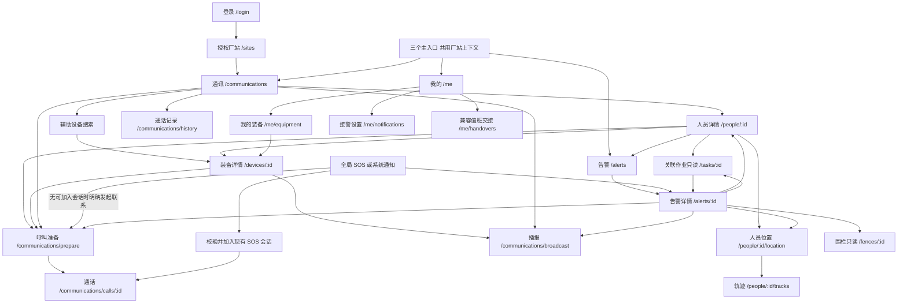

# 安卓页面职责与冲突整改方案

> **2026-09-17恢复说明：本文件为历史分析资料，原有失效状态不变，不是当前施工指令。** 只恢复非亮暗功能、页面与素材分析；外观切换要求已取消。旧三栏、暖石换肤、页面重组等被否定建议仍不得执行。当前执行[10开发指南](10-安卓开发指南-预览图复刻与微调.md)、[11逐页说明](11-安卓逐页开发说明与跳转保留表.md)、[12强限制](12-安卓开发强限制与验收清单.md)及[任务总览](开发任务拆分/01-任务总表与执行顺序.md)；我的页以[最新页面说明](我的页面开发说明.md)为准。

日期：2026-09-17。版本：V2 评审稿。本文重新分配安卓页面职责、定义冲突处理和目标跳转关系，仅用于本轮审核，不表示已经修改程序。

## 1 依据与裁决顺序

业务依据为本目录 [智能穿戴管理平台-整体设计方案.docx](智能穿戴管理平台-整体设计方案.docx)，编号 RL-WEAR-DS-2026-001，V1.0，2026-08-29，原文状态为内部评审稿。下文用其章节号定位要求，不虚构页码。

1. 客户整体方案决定产品对象、业务边界和视觉原则。
2. 本轮用户明确新增：参考浅色与深色预览图、重新分配页面功能、只改文档。
3. 预览图提供手机版式参考；图中示例姓名、设备、菜单、照片和状态不是接口事实。与原文冲突的图面不直接实施。
4. [05 现状分析](05-安卓页面功能与跳转关系分析.md)解释当前代码，不能代替产品需求；旧换肤稿“不改路由、所有入口原样保留”的约束不再适用于本方案。

本文的三主入口、建议路由、移动端返回规则是根据原文推导的设计建议，不是声称客户原文已经指定。整体方案的 PC 左右分栏、200px 侧栏、8 页描述不直接搬到手机。

阅读时区分四类依据：**客户原文**是必须落实的业务约束；**用户本轮新增**是当时页面需求（已更新）；**安卓适配推导**是三入口、子页和返回规则等待审核方案；**当前实现缺口**是源码或联调尚不能支撑的能力。后三类不能冒充客户原文。

## 2 必须遵循的客户设计思路

| 依据 | 客户要求 | 安卓应体现的结果 |
| --- | --- | --- |
| §2.1、§2.3、§10.3 | 电厂现场穿戴平台；App 通话调度、收告警，不做四栏管理端 | 主用户为班组长及有授权的现场调度、接警人员；资产维护和复杂管理留 PC |
| §3、§5.1 | 人是主对象；一人多设备 | 找人后看当前位置与穿戴，再选择可用通信终端；不按帽、带各建一套应用 |
| §3、§5.3 | 能力决定界面 | 视频、语音、TTS、挂钩等入口来自权限和设备能力，不能只看类型名称 |
| §3、§6.6 | 告警统一流水 | 帽、带、气体、近电、围栏等使用同一列表、详情和处理记录 |
| §7.1、§7.2 | SOS 和未挂钩能联系该人员 | 无通信能力的来源设备须解析同人的合法可用终端，不能只呼叫告警来源设备 |
| §3、§7.3、§9 | 位置含区域和层；同人一个主位置 | 人员位置是统一结果，设备不重复打点；缺楼层明确未知，不伪造高度 |
| §7.4 | 厂区统一切换 | 通讯、告警、位置共享一个厂站上下文，不各选各的站 |
| §2.4、§8 | 专业、舒适、严谨；暖石深色与工业蓝 | 默认深色，浅色为本轮新增配套；所有页面共享同一套组件和状态语义 |
| §6.1、§8.6 | 登录不做插画；效果图文案不作为规范 | 登录保留紧凑表单；不照搬大人物、假厂站、示例账号和手写口号 |
| §10.1、§11 | 不复用旧脚手架；AI、签到、完整两票等不进一期 | 记录架构差距；本次功能保留不等于批准沿用旧脚手架，也不擅自启动重写 |

安全带真实接入、层高、组呼、帽端发起属于客户目标。当前依赖不足只能标“待协议／待接口／待联调”，不能以延期实现为理由把客户需求删掉。

## 3 导航方案选择

| 方案 | 组织方式 | 与客户要求的关系 | 本稿意见 |
| --- | --- | --- | --- |
| A | 通讯／告警／我的，人员位置与装备作为上下文 | 聚焦 §10.3 的调度与接警，减少管理入口 | **推荐作为审核版本** |
| B | 保留现场／通讯／消息／我的，现场只剩待办摘要 | 仍保留四栏管理结构、与通讯和告警重复，不符合本次收紧移动端边界的目标 | 历史备选，不推荐，不与 A 视为同等合规方案 |
| C | 完全单页调度台，抽屉打开全部功能 | 核心集中，但手机上通话、列表、处置表单竞争空间 | 暂不采用 |

推荐登录后进入“通讯”；收到告警通知可直接进入告警详情。首次选站流程保留。“我的”只承担身份、接警设置、个人装备等辅助功能，不变成系统管理中心。三入口是本轮移动端适配建议，待审核后才进入实现。

## 4 冲突模块与处置清单

优先级表示整改先后：P0 为误导业务或偏离产品边界；P1 为职责、跳转与一致性问题；P2 为优化。处理分类包括保留、合并、迁移、降级为只读上下文、待依赖开放、移出正式产品。

代码证据的共同根目录为 `android代码/melhat_android-main/lib/`，详细行号见 05 文档。

| 编号 | 冲突模块与功能 | 当前问题 | 依据 | 拟定处理与唯一归属 |
| --- | --- | --- | --- | --- |
| C01 P0 | 现场首页与管理工具 | 作业、人数设备数、查询宫格挤成手机管理台 | §4.2、§8.6、§10.3；`wear/queries/workbench.dart` | 取消管理工作台的主入口职责；找人归通讯、事件归告警、个人资料归我的 |
| C02 P1 | 顶部作业卡与下方作业列表 | 同一 activeTasks 重复展示；工作票看起来成为独立业务 | §2.1、§4.2、§11.2 | 合并为“关联作业”只读上下文；不把巡检工单设为移动主模块 |
| C03 P0 | 作业、装备、断连提示 | 固定人名、票号、手表、在线和断连混入真实页面 | §3 精确原则、§8.6；`workbench.dart:469` 起 | 移出正式数据展示；演示环境显著标识，缺数据就是空或未知 |
| C04 P1 | 我的装备与全站台账 | 我的卡片“查看全部”跳全站设备，语义越界 | §3、§5.1、§6.4 | 本人装备统一在“我的→我的装备”；全站资产维护归 PC；通讯保留按设备搜索的辅助方式 |
| C05 P1 | 人员列表与通讯选择 | 同人及其设备平铺为多个联系人；“N 人”计数不准确 | §3、§7.3、§10.3 | 通讯默认按人组织，展开终端；按设备查找仍归同一选择器，按稳定 ID 去重 |
| C06 P1 | 消息、告警、核验 | 多种命名暗示多套待办或状态机 | §3、§6.6 | 主入口统一“告警”；“处置说明／提交处置”沿用服务端状态机，不新增假“核验完成”状态 |
| C07 P1 | 设备详情 TTS 与对讲 | 两按钮落到完全相同通讯界面 | §6.8；`wear/queries/devices.dart` | 共用通讯模块但保留不同操作意图：语音/视频进入呼叫准备，TTS 进入播报编辑 |
| C08 P0 | 多选与组呼 | 多选后实际只呼第一个对象 | §2.3、§6.8 | 保留组呼目标；接口未就绪时明确不可用，不得静默改单呼；先展示去重后的目标与可达性 |
| C09 P0 | 手机呼叫与安全帽呼叫 | 只判本人已绑帽，仍走本机 RTC | §6.8、§10.3 | 通讯准备页明确“发起端”；帽侧独立控制与回执未联调前不执行，也不冒充手机呼叫 |
| C10 P0 | SOS／带告警的联系对象 | 当前倾向使用事件 deviceId，可能是没有通信能力的安全带 | §7.1、§7.2 | 告警详情保留历史来源；另解析同人当前合法、可用的通信终端，显式展示选中的人和设备 |
| C11 P0 | 登录问题与密码重置 | 本地提示“已记录”，实际没有提交 | §3 精确原则；`wear/auth_pages.dart` | 改为登录帮助与联系管理员；真实重置流程待接口，不保留虚假提交成功 |
| C12 P0 | 验证码降级 | 接口失败或关闭时仍生成本地码，容易混淆安全校验 | §10.2 的鉴权边界；当前登录实现 | 按服务端验证码开关展示；加载失败给重试，不用本地随机码冒充服务端验证 |
| C13 P1 | 位置、轨迹、围栏 | 独立工具分散；楼层能力不足 | §3、§7.3、§9 | 统一人员位置上下文，轨迹为其子页；告警可看发生时位置；围栏只读从关联告警进入，绘制配置归 PC |
| C14 P1 | 切站与返回 | 切站后一律回现场，跨 Tab push/go 混用 | §7.4 | 顶栏共用选站；切站回来源主模块根页，清旧站对象；详情返回来源，通话中禁止切站 |
| C15 P0 | 参考图与正式视觉 | 大人物、蓝色场景背景、KPI 卡、口号与客户严谨风格冲突 | §2.4、§6.1、§8 | 保留列表分组、产品缩略图、上下分区的布局；以客户暖石/工业蓝重定色，减少装饰，详见 08 |
| C17 P1 | 作业交接与失去监护 | 从首页形成另一套移动管理工作流 | §10.3；当前已有接口 | 失去监护保留为授权只读接警线索，不自行造告警；交接放“我的→值班交接”作为兼容能力，是否长期保留须审核 |
| C18 P0 | 附件／原安监／SIP | 效果图容易被当成接口功能清单 | §8.6、§11.2 | 这些不是原文要求的独立模块；无真实接口不展示上传、已同步或已登记成功 |
| C19 P0 | 原脚手架与新目标 | 当前 WearApp 仍建于原 Flutter 工程，与原文“不复用脚手架”有差距 | §10.1 | 单独列架构评审项；本文只指定功能去向，不宣称“只换肤”符合客户要求 |

## 5 新页面职责和功能分配

“已接代码”仅指仓库存在接口调用或交互，不等于真实硬件、生产权限和后台到达验收完成。

| 页面 | 唯一主任务 | 放入的功能 | 不承担的功能 | 主要父页面 |
| --- | --- | --- | --- | --- |
| 登录 | 建立授权身份 | 账号、密码、服务端验证码、登录帮助 | 假厂站、假重置提交、装备宣传图 | 应用启动 |
| 厂站选择 | 选择全局授权范围 | 授权厂站、搜索（数量需要时）、当前站提示 | 另建站点主数据 | 登录或顶栏 |
| 通讯首页 | 找到人员并准备联系 | 人员搜索、队伍筛选（服务端支持时）、设备辅助搜索、近期通话入口、播报入口 | 大数字看板、全站资产 CRUD、任务管理 | 主入口一 |
| 人员上下文详情 | 看懂“这个人、在哪、带什么” | 姓名编号、岗位队伍、票状态、当前主位置、装备槽位、相关告警、关联作业摘要 | 建档、换绑、发放、归还 | 通讯人员行；告警人员信息 |
| 装备只读详情 | 确认可用能力与质量 | 型号、编号、当前持有人、在线质量、电量、上报时间、领用历史、能力按钮 | 入库、报废、编辑、类型独立管理菜单 | 人员详情／我的装备／设备搜索 |
| 呼叫准备 | 明确目标、发起端和方式 | 目标人员/终端、手机或本人帽端、语音/视频、单呼/组呼、权限与能力原因 | 进入页面立即开麦或自动呼叫第一设备 | 通讯、人员、装备、告警 |
| 通话页 | 完成一场通话 | 连接状态、实际媒体画面、静音、挂断、失败重试；已实现的音频路由操作 | 把创建会话成功当已接通、装饰照片充当视频 | 呼叫准备或已授权 SOS 加入 |
| 播报编辑与结果 | 明确范围并下发 TTS | 单人/分组/机组范围、正文、确认目标、逐设备发送结果 | 接口成功即声称听到、未经授权全站广播 | 通讯播报；装备 TTS；告警联络 |
| 通话记录 | 追溯联系情况 | 单呼/组呼/SOS、对象、发起端、时间、结果、关联告警 | 与告警时间线混成第二套处置记录 | 通讯首页 |
| 告警列表 | 发现待处理事项 | 默认未处理、SOS/等级/类型/人员/我负责/逾期筛选、待处理数量 | 按帽、带、气体拆中心，首页重复全量列表 | 主入口二 |
| 告警详情 | 联系并完成授权确认 | 发生时人员设备快照、位置来源、联系入口、授权确认／处置说明、草稿、时间线；复杂管理动作按下述兼容边界 | 擅改工作票或把认领当接通 | 告警列表、全局 SOS、通知、人员相关告警 |
| 人员位置 | 理解一个人的位置与可信度 | 当前主位置／告警发生时快照、厂区区域层、时间/来源/精度/质量、二维与层示意 | 每件装备重复打点、缺数据自动算楼层、独立重孪生系统 | 人员详情／告警详情 |
| 人员轨迹 | 回看人员在时间段内的位置 | 时间段、播放进度和速度、质量、采样提示 | 以陈旧点直接判违规 | 人员位置 |
| 围栏只读详情 | 理解本告警适用的区域规则 | 规则、区域、关联人员、关联围栏告警筛选 | 绘制、启停、规则编辑 | 关联围栏告警；人员位置有可用关系时 |
| 关联作业只读详情 | 解释人员或告警的作业背景 | 区域、成员、票状态、装备检查、关联告警 | 新建工单、排程、复杂成员配置、完整两票 | 人员详情／告警详情 |
| 我的 | 身份与个人工作偏好 | 账号角色、当前厂站、我的装备入口、接警状态、帮助、退出、兼容交接入口 | 全站配置、数据报表、设备台账宫格 | 主入口三 |
| 我的装备 | 查看本人实际领用 | 真实装备列表与历史，缺装备空态 | 自动补三件装备、全站设备“查看全部” | 我的 |
| 接警设置／帮助 | 解释接警可用性 | 权限、前台连接、推送绑定/待验收状态、系统设置、管理员帮助 | 虚构锁屏必达承诺 | 我的 |
| 值班交接 | 保留现有授权交接能力 | 发起、待接班、确认、责任范围 | 未确认即改责任；扩大为新管理模块 | 我的，兼容能力待审核 |

人员详情及其装备、位置、作业是同一人员上下文的子页面，不新增独立“现场管理中心”。无 accountUserId 的作业人员仍能被展示；登录账号和现场人员不能按姓名自动关联。

**处置范围建议：**手机默认突出接警、查看、加入通话、授权确认和说明；分派、转交、复核、重开等复杂管理优先归 PC。现有认领／转交／复核／重开能力、权限、历史和409保稿规则作为兼容清单保留，是否在手机开放次级入口按角色审核，不能把全部按钮默认搬入主操作区，也不能未经迁移使责任记录丢失。客户没有逐项禁止这些动作，这是移动端适配建议。列表“未处理”须按服务端状态定义映射；现有“未关闭”还可能包含待复核项，二者不直接等同。

轨迹与值班交接属于现有兼容能力，不是客户明确要求的独立移动主模块；工作票仅保留状态和风险上下文。完整两票、巡检、工单不会因迁到 PC 就自动进入一期范围。

## 6 原有功能迁移清单

| 当前页面／入口 | 新归属 | 处理方式 |
| --- | --- | --- |
| `/workbench` 问候、品牌、切站 | 共用顶栏／我的身份 | 简化保留，取消大头图 |
| 工作台四指标、近期事件、消息铃铛 | 告警列表筛选和数量 | 合并；失去监护与告警数不同，不混算 |
| 工作台当前作业两块、`/tasks`、`/tasks/:id` | 人员／告警中的关联作业 | 同一只读详情；全站作业列表移出主导航，历史入口按权限转到兼容只读列表 |
| `/people`、`/people/:id` | 通讯找人／人员上下文详情 | 保留搜索和稳定 ID，取消独立人员管理菜单 |
| `/devices`、`/devices/:id` | 通讯按设备查找／装备详情 | 保留查询，资产维护只在 PC |
| `/tracks` | 人员位置→轨迹 | 保留时间范围与回放，必须带明确人员 |
| `/fences`、`/fences/:id` | 关联告警→围栏只读详情 | 保留只读解释；全站围栏管理归 PC |
| `/supervision` | 告警页授权辅助筛选／线索列表 | 仍按实际检查数据展示；不新增未经服务端确认的事件 |
| `/communications` 大一页 | 通讯首页、准备、通话、播报、记录 | 一个业务模块按任务拆子页面；共用一份选人与会话状态 |
| `/events` 列表＋内嵌详情 | 告警列表→独立详情 | 保留权限、草稿与历史；默认接警和授权确认，复杂动作按角色审核次级入口或归 PC |
| `/me` 装备、推送、交接堆叠 | 我的摘要＋对应子页面 | 保留有效能力，各页只做一件主要任务 |
| 旧 AI、签到、旧围栏编辑 | 不进入新正式产品 | 旧源码是否归档由后续工程评审决定，本轮不移动 |

保留的是业务能力和历史记录，不要求原入口数量、原页面结构或原脚手架不变。若接口没有人员关联作业、按围栏筛事件等能力，界面只能使用确有数据的关联，缺口进入接口清单，不能在客户端猜关联关系。

## 7 目标父子页面和跳转关系

以下地址是审核用命名，不是已经存在的路由；旧 `/events` 等 URL 的迁移别名在实现时另做兼容表。现有消息载荷的 eventId 可继续使用，不要求为了改 UI 改服务器事件 ID。

### 跳转携带的信息

- 人员到装备：明确 personId 和 deviceId；详情中的当前持有人与历史领用分别展示。
- 告警到联系：保留 eventId、告警发生时 personId/deviceId；通信目标使用经授权解析的当前终端，不能覆盖历史快照。
- 语音、视频、TTS：传明确 actionIntent；发起端独立标识为本机或本人已绑定终端，目标端不能与发起端混用。
- 告警到位置：默认“发生时位置”，允许用户显式切到“当前人员位置”，两者不能悄悄替换。
- 同人多可用终端：由用户确认目标，或使用服务端明确主终端规则并展示结果；不可静默选择首条记录。
- 多人组呼／播报：以服务端接受的目标 ID 集合去重，展示人数与设备数区别，不把一个人和他的帽子算两个参与者。
- SOS“加入通话”先校验现有会话、厂站与参与权限，再进入同一通话页；无可加入会话时改为明确的“发起联系”流程，不把创建新会话标成加入，也不重复拨号。

### 返回和跨页规则

1. 主入口切换保存各自筛选、滚动和草稿；再次点击当前主入口回其根页，保留已保存筛选。需要提示的未保存输入仍按草稿规则处理。
2. 列表→详情→子详情保留来源；返回逐级退回，不固定跳到通讯首页。
3. 跨主模块的“联系此人／查看关联告警”属于带来源的任务跳转，完成后可返回来源。单纯点底栏只切主模块，不叠加重复根页。
4. 通话状态由共用会话持有，离开通话画面仍可从全局通话条返回；真实后台持续媒体未验收时应明确限制，不能只凭路由保留就承诺持续通话。
5. 切站成功保留来源主模块，返回该模块根页并清理旧站选择；草稿按账号与站隔离。旧站对象不能跟到新站。无来源的首次选站进通讯。
6. 通话中禁止切站、退出，不得断开 RTC。
7. 冷启动通知先登录和授权校验，再打开对应告警；无权事件不泄露详情，授权厂站切换完成后再读取对象。
8. 关闭告警详情应与路由同步，不能留下一个会再次展开旧事件的 eventId 参数。

## 8 核心业务保留与未完成依赖

| 能力 | 客户目标 | 当前边界 | 安卓整改要求 |
| --- | --- | --- | --- |
| 单呼／视频／SOS | 可联系现场，状态可追溯 | 有客户端与会话接口代码；真实 RTC 仍须设备验收 | 只有真实媒体与服务端状态共同满足才显示接通；demo 独立标识 |
| 组呼、帽侧发起 | §6.8、§10.3 明确目标 | 当前多选替代单呼、帽侧没有独立链路 | 保留设计位置和验收条目；待后端与厂商依赖，不用伪功能替代 |
| 手机／PC 账号作为通话目标 | 预览图展示；原文含联系手机场景 | 当前 people 并不等于可呼叫 App/PC 账号 | 通讯终端类型需服务端明确定义；无账号通话能力时不把“人员”显示成已可呼 App/PC |
| TTS 范围 | 单人、分组、机组，逐设备结果 | 客户端当前偏单设备；分组/范围权限仍需确认 | 保留范围层级；无回执显示未确认听到；不可客户端拼全站绕权限 |
| 安全带未系／未挂钩 | §5.2、§7.2、§11.1 为首批闭环目标 | 协议和真实遥测缺口 | 人的装备槽、统一告警、同人联络保留；扣合、位置等未知不标正常 |
| 气体胸卡与扩展类型 | 一期或紧随；能力注册 | 当前不能以手表静图代表扩展接入 | 保留类型能力模型，不为每种类型单做主菜单 |
| 区域与层高 | 人在何区域何层；多源统一位置 | 现有 GNSS 和 floor 未知不能证明分层定位 | 页面预留可信层信息与来源；没有就显示未知，层剖面仅作示意，不能假落点 |
| 工作票状态与升级 | §2.1、§5.4 无票在高风险区参与升级 | 当前存在 unverified 待核实语义 | 已确认无票按服务端规则提示；待核实不等于无票违章；不制作电子两票流程 |
| 统一告警处置 | 同一流水与处理说明 | 当前已有更细角色、版本和复核机制 | 保留授权约束及409保稿，视觉精简不删责任闭环；已看见不等于已处理 |
| 后台接警 | App 收告警 | 推送安装绑定和真机到达仍有依赖 | 告警入口与接警状态必须诚实，配置完成不等于后台验收通过 |

上述依赖需后端／PC／硬件负责人配合；本轮只记录接口和交付边界，不修改其系统。应用结构和接口协议变更另行冻结，不能将建议参数当成后端已支持字段。

## 10 审核与后续验证条件

本轮的推荐不是客户原文的新版本，也不将客户内部评审稿直接升版。审核时重点看三项：三主入口是否接受；参考图装饰是否按原文克制处理；值班交接与关联作业作为兼容只读／辅助能力是否保留。

批准后实现须至少验证：

- 通讯按人查找，帽／带等归同一人；没有能力和权限的操作不能成功执行。
- 带来源 SOS 能正确解释来源与联络终端，未知位置不会编楼层；无终端时明确无可用渠道。
- 同一告警从通知、列表、人员详情进入均使用同一详情与状态机，认领冲突保留草稿。
- 组呼不可用不会偷偷单呼；帽侧不可用不会偷偷改手机；密码帮助不会伪造提交。
- 切站后各模块对象一致，不能残留旧站数据；返回链不会循环叠根页面。
- 登录、主子页面、弹窗、键盘区域、地图容器和通话控件均需可读；字号放大仍可操作，状态不只靠颜色。
- 当前代码、后端/硬件可用性与本次验收结果分别记录。未闭环的客户目标明确列为缺口，不把“图画好了”计为业务完成。

客户 §10.1“不复用脚手架”另设架构审核；本文件不以复用现有组件的便利覆盖该要求。客户 §4.1 的八页属于 PC 设计，不能直接解释为安卓必须制作八个主页面。
